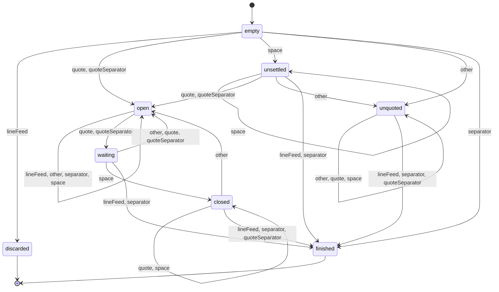

# Detailed explanation of the CSV parser

## Preliminaries

The functionality of the parser will be explained here in depth.
This is an ECMAScript 2015 module.

There are a few coding patterns I use throughout the code:

* Arrow IIFEs to return a function — or an object containing a function — with other variables encapsulated in the same scope.
  This is known as the [closure] pattern

  ```js
  const result = (() => {
      const encapsulated = value;
      
      return (arg) => {
        doSomething(encapsulated, arg);
      };
    })();
  ```

* Method extraction for when I use a function that needs to bind a `this` context:

  ```js
  const {
    result
  } = {
      result(arg){
        return something(this, arg);
      }
    };
  ```

* [Destructuring][destructuring]

## Top-down explanation of the code

The value exported by default is the result of an arrow IIFE.
The return value of that function expression is an object containing two methods: `parse` and `stringify`.
Several other constant variables are scoped within the arrow IIFE.

### Parsing

The **`parse` method** accepts two arguments:

1. `csv`, and
2. `{ quote = "\"", separators = [ "," ], forceLineFeedAfterCarriageReturn = true, ignoreLineFeedBeforeEOF = false, ignoreSpacesAfterQuotedString = true, taintQuoteSeparatorLines = false } = {}`.

So, if only one argument is provided, the empty object will be the default second argument, otherwise the real second argument is used.
In any case, these properties are destructured from the second argument:

* `quote` (defaulting to the string `"\""` if missing),
* `separators` (defaulting to `[ "," ]`),
* `forceLineFeedAfterCarriageReturn` (defaulting to `true`),
* `ignoreLineFeedBeforeEOF` (defaulting to `true`),
* `ignoreSpacesAfterQuotedString` (defaulting to `true`),
* `taintQuoteSeparatorLines` (defaulting to `false`).

The defaults assume that the CSV file has quoted values like `"Value"`, has comma-separated columns, follows the RFC recommendation of using only `\n` or `\r\n` as line breaks, and the default line break at the end of the file can be ignored.

#### Preprocessing the CSV file

First, `csv` is processed in this order, applying some of the boolean settings:

1. Every line break is replaced by `"\n"`.
   * The **`strictLineBreakGroups` RegExp** (alternatives `\r\n` and `\r`, globally) is used if `forceLineFeedAfterCarriageReturn` is `true`;
   * otherwise the **`looseLineBreakGroups` RegExp** (alternatives `\r\n`, `\n\r` and `\r`, globally) is used.
2. If `ignoreLineFeedBeforeEOF` is `true` and `csv` actually ends with a line feed, then the string isn’t modified; in any other case a line feed is appended to make parsing consistent.
3. All null bytes are removed.

Note that null bytes are only removed after line breaks are handled.
This is how LibreOffice Calc does things.

#### Validating quotes and separators

Next, the quote must only be a single character, but multiple separators can be provided.
To make sure these restrictions hold, the **`toCharArray` function** is used: both variables are checked whether they are a string or an array, and then are converted to an array, each containing its allowed string delimiter or cell separators.
If the argument is a string, an array of characters is returned.
If the argument is an array, it is returned, but with everything that isn’t a single-character string removed.
Otherwise, the empty array is returned.

Both resulting arrays are filtered using the **`validQuotesAndSeparators` function**: quotes and separators cannot be empty, `"\n"`, or `"\r"`.
For the resulting `quote` array, only the first single-character string element is used (or the empty string, if `undefined` or empty).

It doesn’t matter if these special characters are empty; they will just never be matched.

#### Tokenization

At this point, the CSV text is preprocessed so it can be parsed more easily.
Now, the string is split into its characters using `Array.from(csv)`.
Note that `csv.split("")` isn’t used, since that would split the string into UTF-16 code units instead of Unicode characters (e.g. `🕴` would be split into the string `\uD83D\uDD74` of length 2).
With `Array.from(csv)` (or, equivalently, `[ ...csv ]`), a levitating man in a business suit can be used to quote values in this CSV parser.

Now, the fun part begins: going through the CSV file, character by character, while figuring out where a table cell starts and where it ends by transitioning states in a finite automaton.
Since we need to iterate while maintaining a few states, `reduce` is used here.
All the resulting data and states are aggregated in the “aggregator” — the second `reduce` argument; it consists of:

* `array`: the nested array containing rows of table cells representing the result of the parsing step,
* `parserState`: the current state of the parser given the current character,
* `quote`,
* `separators`,
* `ignoreLineFeedBeforeEOF`,
* `taintQuoteSeparatorLines`: the boolean enabling the [buggy behavior][taint] from LibreOffice Calc version 6.3.3.2.0 — only actually enabled if the set of `separators` includes `quote`,
* `lineTaint`: the current state of the line (i.e. table row): essentially _tainted_ or not.

`quote`, `separators`, `ignoreLineFeedBeforeEOF` are needed as-is in the parser.

“Parsing” here means to **_tokenize_ the CSV file into its cells**.
That’s why the `reduce` method calls the **`tokenizeCells` function** which accepts all four reducer parameters `aggregator`, `character`, `index`, `string`.
The last two are needed to check when the end of the file is reached.
The tokenizer is called in each iteration (i.e. for each `character`) and performs these steps:

1. Classify the current character,
2. Given the character class, transition from the current parser state to the next one,
3. Manipulate the parser state for special cases (e.g. tainted rows),
4. Decide how the character affects the `array` in the `aggregator` based on the new state,
5. Return the `aggregator` for use in the next iteration.

##### Character classes

Two functions are used to classify characters in two different ways:

The **`classifyCharacter` function** receives a character as an input, along with the currently used quote character and the set of cell separators.
It returns an array of all the sets the character is in.

Specifically, the character can be _in_:

* `lineFeed` if it’s `"\n"`,
* `quote` if it’s exactly the one `quote` being used,
* `separator` if it’s one of the `separators`,
* `space` if it’s the space character U+0020,
* `other` if it’s anything else.

The result is an array of these character class names as strings.
For example:

* If your `quote` is `"\""` and `separators` is `[ "," ]` (the default), then `","` will be classified as `[ "separator" ]`, `"*"` as `[ "other" ]`.
* If your `quote` is `" "` and `separators` is `[ " ", "," ]`, then `","` will still be classified as `[ "separator" ]`, but `" "` as `[ "quote", "separator", "space" ]`.

The **`reduceClass` function** converts the array to a single, simplified string.
In order to understand which reduced classes are specifically needed, we first need to take a look at the state transitions.

##### States

When going through a CSV file character by character, there are a couple of states that need to be tracked.
For example:

* Is a cell empty?
* Is a cell quoted or unquoted?
* Is a quoted value open or closed?

When reading from left to right, it’s not known whether a value is quoted or unquoted if there are a bunch of spaces at the start.
Of course, a value can be neither open nor closed if it’s not quoted to begin with.
But _if_ it’s quoted, it turns out that a state “in between” open and closed is needed for some special cases: in this case it’s called “waiting” (as in waiting to see if the quoted value actually ends at a specific character).

There also needs to be at least one final, accepting state — in this case there are two.
A cell can simply be “finished” when it’s completely read; then a new cell starts after the finished cell has been placed into the table.
But a cell could also be _discarded_ when it’s an _empty_ cell after a trailing comma at the end of a row; for example, this CSV file only has two columns, not three:

```csv
Greek,Hebrew,
Alpha,Alef,
Beta,Bet,
Gamma,Gimel,
```

After eliminating impossible state combinations (like “unquoted and open”), these are the reasonable states:

* `empty`: when a cell hasn’t started yet; e.g. at the beginning of a file, or each time a new cell begins.
* `unsettled`: when the cell has content, but so far only spaces, and it’s not known yet whether the value will be quoted or not.
* `unquoted`: when the cell has unquoted content.
* `open`: when the cell has quoted content and the current character is within the quote (or opens it).
* `waiting`: when the cell has quoted content and the current character might be outside the quote (or closing it).
* `closed`: similar to `waiting`, but with a larger bias towards keeping the quote closed and finishing the cell.
* `finished`: when the cell is finished and is to be included in the table.
* `discarded`: when the cell is finished but is not to be included in the table.

When reading quotes inside a quoted value, the states generally switch from `open` to `waiting` and vice-versa.
The `waiting` state is useful for escape sequences of quotes (e.g. `""` inside a quoted value creates a single `"`); in the `closed` state, these aren’t possible.
A `closed` cell can still be reopened, but in fewer circumstances than in the `waiting` state.
The exact differences will be explained in the state transition diagram below.

Technically, you could differentiate between two variants of `finished` — a finished _row_ or a finished _cell_ — but these are distinguished specially using `if` statements.

##### Reduced character classes

When considering what kinds of characters might be read, these are all the possibilities:

* `lineFeed`
* `other`
* `quote`
* `separator`
* `space`
* `quote` and `separator`
* `quote` and `space`
* `separator` and `space`
* `quote`, `separator` and `space`

But, fortunately, extensive testing shows that some possibilities have exactly equivalent behavior:

* _`quote` and `space`_ behaves exactly like _just `quote`_,
* _`separator` and `space`_ behaves exactly like _just `separator`_.

There’s also a close similarity between _`quote` and `separator`_ versus _`quote` and `separator` and `space`_.
Only one state transition cannot be tested, because it’s actually unreachable: if `quote` and `separator` are both a `space`, then the `closed` state can never be reached.
All other transitions from these two possible sets of character classes are identical, so we can say:

* _`quote` and `separator` and `space`_ behaves exactly like _`quote` and `separator`_.

As a result, the **`reduceClass` function** only considers these simplified character classes for transitioning states:

* `lineFeed`,
* `other`,
* `quote`,
* `separator`,
* `space`,
* `quoteSeparator`: the combination of `quote` and `separator`, i.e. if a character is both the `quote` and one of the `separators`.

##### State transition diagram

This is the full diagram of state transitions based on the reduced character classes.
All this was basically reverse engineered using LibreOffice Calc.



Some things to point out:

* An unquoted value can either be terminated by any character that terminates cells or rows, or it remains unquoted.
* An open quoted value remains open, but a quote character puts it into the waiting state, where the parser waits for one of several possibilities:
   * A line feed or cell separator will immediately finish the cell
   * Another quote results in an escape sequence and leaves the quote open
   * A space closes the quote: no escape sequence is possible at this point
   * A random “other” character means that the CSV is malformed, but it’s interpreted as part of the quoted value — the unescaped quote characters are included in this value verbatim
* Spaces are just special because they are usually ignored before and after quoted values, so they almost never change the state, except where they take away the opportunity to create an escape sequence for quotes.
* Once a quoted value is closed, a quote character will leave the cell closed since a quoted value needs to end with a quote; it can still be reopened (i.e. literally transition to the `open` state) with any “other” character. Escape sequences are possible again after this point.
* At the start of a cell, a `quoteSeparator` opens quoted values rather than finishes cells.
* A `quoteSeparator` behaves like a quote when an escape sequence is still possible, but like a separator when it isn’t.
* If the `quote` or one of the `separators` is a `space`, then the `closed` state can never be reached since the only entry point for this state is from `waiting` via `space`. But `space`, as such, doesn’t exist in this case: the character class for a space is always going to be reduced to either `quote`, `separator`, or `quoteSeparator`.

This is how it’s implemented in the code: the **`transition` function** takes the current state (`parserState`) and the reduced character class (`reducedClass`), then returns `states[parserState][reducedClass]`.
`states` is an object whose keys are all possible states; their values are objects whose keys are all possible reduced character classes; and _their_ values are the corresponding next states.

Since `empty` and `unsettled` are very similar, `empty` doesn’t appear in the `states` object; instead it is specially handled with a simple `if` statement.

Taking the example from above, `states["unsettled"]["quote"]` is the same as this:

```js
({
  lineFeed: "finished",
  other: "unquoted",
  quote: "open",
  quoteSeparator: "open",
  separator: "finished",
  space: "unsettled"
})["quote"]
```

And this expression evaluates to `"open"`.

##### Affecting the table based on the state

Now that the next state is determined, the table can be updated based on the character that was read.
Basically, characters that are part of the cell contents are “consumed” (i.e. placed into the current cell).
The separators and line feeds control how cells and rows are created or deleted.

Specifically, these steps happen:

1. If the cell needs to be discarded, the **`discardCell` function** is called and the last cell in the table is removed; if this happens, the rest of the steps continue as if the state was `finished`
2. Is the last character of the CSV file being read?
   1. If _no_, is the cell finished?
      1. If _yes_, then the **`endCell` function** is called to end the cell and create the next one; whether the next cell is in the next column or in the next row depends on the character.
      2. If _no_, the current character is simply consumed using the **`consume` function**.
   2. If _yes_, quoted values that weren’t properly closed before EOF are handled: they are closed, and the line feed before EOF may be included depending on parser settings and inputs.

##### Tainting rows

_Before_ the normal updates to the table described above, the parser state and the `lineTaint` may be manipulated.
Essentially, the next parser state can be directly changed, but only if `taintQuoteSeparatorLines` is enabled and applicable.
A state called `lineTaint` is also read and set.
This state controls whether a specific upcoming quoted cell would be affected by the [buggy behavior][taint] (which I call “tainted rows”), i.e. whether a line break is allowed within that cell.

* `none`, if the current row is not “tainted” so far, and upcoming quoted cells may include line breaks,
* `inactive`, if the current row is “tainted” but the upcoming cell would _not_ exhibit the buggy behavior,
* `active`, if the current row is “tainted” and the upcoming cell would exhibit the buggy behavior.

A helper function is used to distinguish between two cases where the state would be set to `active` or `inactive`: the **`lineTaintActivation` function**.
This function sets the `lineTaint` state in one of these two cases:

* If a `quoteSeparator` was read, set `lineTaint` to `active`,
* otherwise, if a `separator` was read, set `lineTaint` to `inactive`.

In summary, calling this function with the current `reducedClass` controls whether or not the next cell would exhibit the buggy behavior.
For cell separators that are the same as quote delimiters, it _would_.
For cell separators that aren’t, it _wouldn’t_.

There are two phases with a couple of steps that activate, deactivate and manipulate the states:

In the first phase, the conditions for activating and deactivating row “taint” are checked.

* If a cell is finished and the next cell follows — but _not_ a new row —, _and_ the parser previously was either in the `closed` or in the `waiting` state, then this means that the parser just finished tokenizing a cell with a _quoted_ value.
Starting from here, the row becomes “tainted”, but in this case `lineTaintActivation` is called in order to determine whether the next cell is actually affected by the “taint”.
* If the previous condition wasn’t met exactly, but the cell is still finished _or_ discarded, then two options remain:
   1. A new row follows.
   In this case the `lineTaint` is just reset to `none`.
   2. If a new row doesn’t follow, then this means that the parser just finished tokenizing a cell with an _unquoted_ value.
   In this case, _if the row is indeed “tainted”_, `lineTaintActivation` is called.

In the second phase, affected cells are handled.
If the `lineTaint` is now `active` and a `lineFeed` is encountered, but we’re still in the `open` quoted cell, _that’s where the bug actually occurs_:

1. Close the quote (by consuming a quote character),
2. Set the next parser state to `finished`,
3. Reset `lineTaint` to `none`.

After all this, the parser state is finally updated (`aggregator.parserState = nextState;`) and the [regular updates to the table][table-updates] may proceed.

#### Processing quoted values

After tokenization, the `array` property is taken from the parsing process.
As a reminder: `array` is a nested array containing rows of table cells.
It’s an array of arrays of strings.

Each string is then processed in the **`parseSubArrays` function** to remove quotes and spaces around quoted values and handle escape sequences.
The **`parseString` function** removes surrounding spaces and quotes, and keeps the value inside.
It uses a polyfill of the proposed [`RegExp.escape`][regexp-escape] function to escape quotes that might be special regex characters.
Next, doubled quotes are replaced by single quotes, which takes care of handling escaped quotes.

The result is an array that still has the same structure as the array after tokenization.
This result is then destructured into one `header` row (the first row) and all the other `rows`.

#### Building the parser output

At this point, the `header` row and the other `rows` are almost finished.
The `mappedRows` still need to be created.
`mappedRows` is generated by a mapping operation based on `rows` and `header`.
The **`toHashMap` function** simply creates an object for each row and populates it with each header as the key and each cell value as the value of each entry.

#### Parsing example

Consider this CSV file:

```csv
Hello,"World" ,  1 2 3  ,
A,B,"C
Line, ""feed""."
```

Split by characters, it looks like this:

```none
H e l l o , " W o r l d " ␣ , ␣ ␣ 1 ␣ 2 ␣ 3 ␣ ␣ , ↵ A , B , " C ↵ L i n e , ␣ " " f e e d " " . "
```

`␣` is used to represent the space characters, `↵` to represent the line feed characters.

Keep in mind that every `finished` and `discarded` state is followed by an implicit `empty`.
End of file (EOF) is treated like a line feed, so e.g. the `waiting` state at EOF would result in transitioning to the state `finished`.
With default settings, this is how the parser state changes and what exactly happens when reading this string of characters:

```none
Start with state `empty`
| Read first letter; change state to `unquoted`   After the implicit `empty`, set `discarded`
| |                                                 | unquoted
| |                                                 | | finished
| |                    closed finished     finished | | | unquoted
| |     finished    waiting | | unsettled         | | | | | finished                  waiting open
| |         | open        | | | |  unquoted       | | | | | | open        waiting open      | |  waiting
| |         | |           | | | |   |             | | | | | | |                 | |         | |   |
  H e l l o , " W o r l d " ␣ , ␣ ␣ 1 ␣ 2 ␣ 3 ␣ ␣ , ↵ A , B , " C ↵ L i n e , ␣ " " f e e d " " . "
 '---------' '---------------' '-----------------'   '-' '-' '-------------------------------------'   These are the consumed cells
'-------------------------------------------------' '-----------------------------------------------'  These are the rows consisting of the above cells.
```

### Stringification

The stringification process is a lot simpler than the parsing process.
It starts by testing if the input is an Array.
If it is, the first element is interpreted as the header row, and the remaining elements are interpreted as the remaining rows.
Alternatively, it takes the `header`, `rows`, and `mappedRows` keys of the input object, and checks if `rows` has any content.
If it doesn’t, it fills the `rows` from the `mappedRows` using the **`toRows` function** and the **`mapHeaderKeys` function**, which simply iterates over the provided `header` and evaluates the keys, cell by cell.

Next, the number of columns is determined so that the output can be nicely padded from the right.
Empty rows are removed from the bottom based on `trimEmpty`; empty columns are removed from the right based on string emptiness.

Finally, in the **`quoteString` function**, for each cell, quotes are escaped by doubling them up, and every string that includes line breaks, quotes, or cell separators is quoted.
Then, in the **`toCSVLine` function** every cell is joined by the provided `separator`, and then, in the **`stringify` function** proper, every row is joined by the provided `lineEnd`.
Another `lineEnd` is appended if `lineEndBeforeEOF` is set.

## Testing

_How was the parser / stringifier actually tested?_

Several special cases (e.g. empty file, null bytes, space characters other than U+0020, conflicting quotes and cell separators, etc.) were tested using hand-crafted test files.
I simply opened these in LibreOffice Calc and in a few other parsers to see how these CSV examples were interpreted.

But the really powerful testing technique was _fuzzing_.
Fuzzing revealed the “tainted line” bug in LibreOffice Calc and a few other weird discrepancies.

I wrote a fuzzing test generator to generate test files and test outputs.
This is what I did with the help of the generator:

1. Generate a string that contains a random sequence of special characters (line feeds, carriage returns, all cell separators, the quote, spaces, null bytes, etc.) and put it into a file (the “raw” file).
2. Feed the “raw” file into the parser (with all the relevant options).
3. Stringify the parser output to a “nice” CSV output using a consistent quote and cell separator.
4. Create an “annotated” output that makes unprintable characters readable (e.g. prepending each line feed with `⟨LF⟩`, each space with `⟨SP⟩`, etc.). This makes debugging different outputs easier.
5. Open the “raw” file in LibreOffice using exactly the same settings and all columns formatted as text and then save it into another file (the “libre” file) using the same output options as this stringifier.
6. Compare the “nice” file to the “libre” file.

Eventually, null bytes and the variety of spaces didn’t cause difficulties any longer, so I simplified the tests by removing these characters.
At some point, I felt confident enough to use `diff` to compare files, which is automatic, but also byte-exact.
I started with 100-character strings, then felt confident enough to test 1000-character strings.

The different parser options were generated using a few simple cases:

* `quote` was set to `"\""`, `","`, or `" "` in the tests.
* `separators` was set to `[ "," ]`, `[ "*" ]`, `[ " " ]`, `[ ",", "*" ]`, `[ ",", " " ]`, `[ "*", " " ]`, or `[ ",", "*", " " ]` in the tests.

All combinations of the two were tested a couple of times.


  [closure]: https://stackoverflow.com/q/111102/4642212
  [destructuring]: https://developer.mozilla.org/en-US/docs/Web/JavaScript/Reference/Operators/Destructuring_assignment
  [regexp-escape]: https://esdiscuss.org/topic/regexp-escape
  [taint]: README.md#taintquoteseparatorlines-boolean-default-false
  [table-updates]: #affecting-the-table-based-on-the-state
